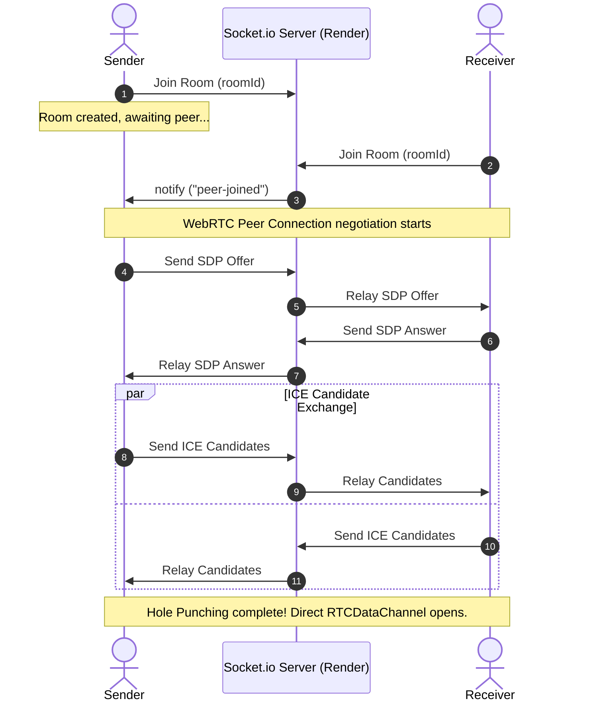

# ⚡ WebShare — Secure, Serverless P2P File Transfer

> An ultra-fast, client-side, encrypted peer-to-peer file sharing web application utilizing WebRTC and Socket.io for decentralized 1-to-1 transfers directly in your browser.

---

## 🎬 Project Demo Video
<!-- 
  REPLACE THIS SECTION WITH YOUR ACTUAL DEMO EMBED OR LINK.
  For example:
  [](https://www.youtube.com/watch?v=YOUR_VIDEO_ID)
-->
```
+--------------------------------------------------------------------------+
|                                                                          |
|                      [ INSERT DEMO VIDEO / GIF HERE ]                    |
|                                                                          |
|   Recommended details to record:                                         |
|   1. Sender dragging a file into the upload zone and generating code     |
|   2. Receiver opening the invite link and automatically joining          |
|   3. Files transferring with progress, speed, and SHA-256 checks         |
|   4. Triggering of auto-download on complete and graceful disconnects    |
|                                                                          |
+--------------------------------------------------------------------------+
```

---

## 🎯 Project Aim & Core Architecture

Traditional file-sharing tools rely on middleman servers to upload, store, and distribute files. This introduces security risks, storage fees, speed bottlenecks, and privacy concerns. 

**WebShare** aims to establish **secure, serverless, 1-to-1 direct transfers** between any two browsers on the internet:
* **Middleman-Free**: Files never touch any cloud storage database. They flow directly from the memory/disk of the sender into the memory of the receiver.
* **Low Memory Footprint**: Large files are split into small, manageable $16\text{ KB}$ chunks, processed sequentially via the browser's `FileReader` API, and streamed on-demand.
* **Zero Corruption**: Every chunk is cryptographically signed with a **SHA-256 hash** before transmission and verified on receipt to guarantee bit-for-bit file integrity.

---

## 🛠️ Technology Stack

| Component | Technology | Role |
| :--- | :--- | :--- |
| **Frontend Core** | **React (Vite)** | Reactive single-page user interface. |
| **Styles / Theme** | **Vanilla CSS3** | Custom properties, fluid glassmorphism UI, keyframe micro-animations. |
| **Signaling Server** | **Node.js, Express, Socket.io** | Coordinates initial handshakes, SDP exchange, and ICE candidates. |
| **P2P Streaming** | **WebRTC (DataChannels)** | Directly streams binary chunks over UDP/TCP hole-punched routes. |
| **Security & Integrity**| **Web Crypto API** | Implements asynchronous, hardware-accelerated SHA-256 hash checks. |

---

## 📊 Workflow & Peer-to-Peer Protocol

### 1. Signaling Handshake Flowchart
This diagram illustrates how the two peers find each other using Socket.io and establish the WebRTC direct data channel:



### 2. Direct P2P Chunk Streaming Protocol
Once the connection is open, the data channel takes over, bypassing the signaling server completely:

```mermaid
sequenceDiagram
    autonumber
    actor Sender
    actor Receiver

    Note over Sender: File is read as chunks (16KB)
    Sender->>Receiver: send("file-meta" - name, size, totalChunks)
    Note over Receiver: Allocates buffer array for incoming chunks
    
    loop For each chunk (offset to EOF)
        Note over Sender: Compute SHA-256 of 16KB chunk
        Note over Sender: Pack: [Index (4B)] [Hash (32B)] [Data (16KB)]
        Sender->>Receiver: Stream Binary Data Array
        Note over Receiver: Unpack index and sent SHA-256
        Note over Receiver: Compute SHA-256 of received Data
        alt Hash Matches
            Note over Receiver: Write chunk to buffer; update speed & progress
        else Hash Mismatch (Corrupted)
            Note over Receiver: Trigger Error, Halt transfer
        end
    end
    
    Sender->>Receiver: send("transfer-complete")
    Note over Receiver: Reassembles chunks into single Blob
    Note over Receiver: Automatically triggers browser file download
```

---

## 📁 Repository Folder Structure

```
WebShare/
├── client/                     # Frontend App (React + Vite)
│   ├── public/                 # Static public assets
│   ├── src/
│   │   ├── assets/             # Images, logos, icons
│   │   ├── components/         # Sub-screen components
│   │   │   ├── LandingScreen.jsx    # Home page for creating/joining rooms
│   │   │   ├── SenderScreen.jsx     # Sender interface (Drag/drop files, invite links)
│   │   │   └── ReceiverScreen.jsx   # Receiver interface (Real-time speed, auto-download)
│   │   ├── hooks/
│   │   │   └── useWebRTC.js    # Custom React Hook containing WebRTC & signaling logic
│   │   ├── App.css             # Component-level styling overrides
│   │   ├── App.jsx             # Main routing & layout controller
│   │   ├── index.css           # Premium glassmorphism design tokens & styles
│   │   └── main.jsx            # React root mount point
│   ├── package.json            # Vite frontend dependencies & build scripts
│   └── vercel.json             # Vercel redirection rules for SPA router
└── server/                     # Signaling Server (Node.js + Socket.io)
    ├── server.js               # Main server logic & CORS configurations
    └── package.json            # Server-side scripts and dependencies
```

---

## 💻 Local Compilation & Execution

To compile and launch WebShare locally:

### 1. Pre-requisites
Make sure you have [Node.js](https://nodejs.org/) installed (v16+ recommended).

### 2. Spin up the Signaling Backend
```bash
cd server
npm install
npm start
```
*The server will start listening on port `3001`.*

### 3. Spin up the Vite Frontend
In a new terminal window:
```bash
cd client
npm install
npm run dev
```
*Open `http://localhost:5173` to view the app.*

---

## 🚀 Hosting & Deployment Guide

### Backend: Hosting on Render
1. Sign up on [Render](https://render.com/).
2. Click **New +** and select **Web Service**.
3. Connect your Git repository.
4. Set the following parameters:
   * **Name**: `webshare-signaling`
   * **Runtime**: `Node`
   * **Build Command**: `npm install` (in the `server` directory)
   * **Start Command**: `node server.js`
5. Under **Advanced Options**, add the environment variable:
   * `PORT` = `10000` (or leave blank; Render binds automatically)
6. Deploy the web service and copy the public URL (e.g., `https://webshare-signaling.onrender.com`).

### Frontend: Hosting on Vercel
1. Sign up on [Vercel](https://vercel.com/).
2. Click **Add New Project** and select your repository.
3. In the project build configurations:
   * **Framework Preset**: `Vite`
   * **Root Directory**: `client`
   * **Build Command**: `npm run build`
   * **Output Directory**: `dist`
4. Add the Environment Variable under **Environment Variables**:
   * **Key**: `VITE_SERVER_URL`
   * **Value**: *Your Render backend URL (e.g., `https://webshare-signaling.onrender.com`)*
5. Click **Deploy**. Vercel will output a unique direct hosting link (e.g., `https://webshare-client.vercel.app`).

*Now, when the sender shares the direct link, receivers can join automatically by opening the URL on any internet connection.*
