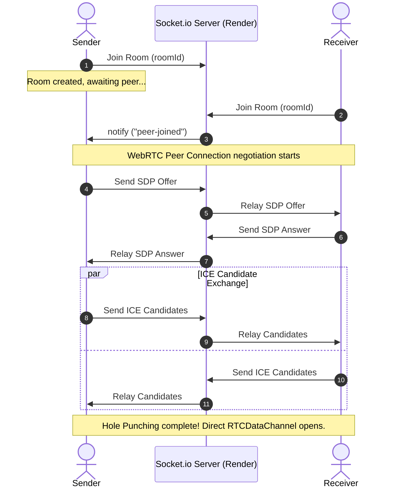

# ⚡ WebShare — Secure, Serverless P2P File Transfer

> An ultra-fast, client-side, encrypted peer-to-peer file sharing web application utilizing WebRTC and Socket.io for decentralized 1-to-1 transfers directly in your browser.

---

## 🎬 Project Demo Video
<!-- 
  REPLACE THIS SECTION WITH YOUR ACTUAL DEMO EMBED OR LINK.
  For example:
  [](https://www.youtube.com/watch?v=YOUR_VIDEO_ID)
-->
```
+--------------------------------------------------------------------------+
|                                                                          |
|                      [ INSERT DEMO VIDEO / GIF HERE ]                    |
|                                                                          |
|   Recommended details to record:                                         |
|   1. Sender dragging a file into the upload zone and generating code     |
|   2. Receiver opening the invite link and automatically joining          |
|   3. Files transferring with progress, speed, and SHA-256 checks         |
|   4. Triggering of auto-download on complete and graceful disconnects    |
|                                                                          |
+--------------------------------------------------------------------------+
```

---

## 🎯 Project Aim & Core Architecture

Traditional file-sharing tools rely on middleman servers to upload, store, and distribute files. This introduces security risks, storage fees, speed bottlenecks, and privacy concerns. 

**WebShare** aims to establish **secure, serverless, 1-to-1 direct transfers** between any two browsers on the internet:
* **Middleman-Free**: Files never touch any cloud storage database. They flow directly from the memory/disk of the sender into the memory of the receiver.
* **Low Memory Footprint**: Large files are split into small, manageable $16\text{ KB}$ chunks, processed sequentially via the browser's `FileReader` API, and streamed on-demand.
* **Zero Corruption**: Every chunk is cryptographically signed with a **SHA-256 hash** before transmission and verified on receipt to guarantee bit-for-bit file integrity.

---

## 🛠️ Technology Stack

| Component | Technology | Role |
| :--- | :--- | :--- |
| **Frontend Core** | **React (Vite)** | Reactive single-page user interface. |
| **Styles / Theme** | **Vanilla CSS3** | Custom properties, fluid glassmorphism UI, keyframe micro-animations. |
| **Signaling Server** | **Node.js, Express, Socket.io** | Coordinates initial handshakes, SDP exchange, and ICE candidates. |
| **P2P Streaming** | **WebRTC (DataChannels)** | Directly streams binary chunks over UDP/TCP hole-punched routes. |
| **Security & Integrity**| **Web Crypto API** | Implements asynchronous, hardware-accelerated SHA-256 hash checks. |

---

## 📊 Workflow & Peer-to-Peer Protocol

### 1. Signaling Handshake Flowchart
This diagram illustrates how the two peers find each other using Socket.io and establish the WebRTC direct data channel:



### 2. Direct P2P Chunk Streaming Protocol
Once the connection is open, the data channel takes over, bypassing the signaling server completely:

```mermaid
sequenceDiagram
    autonumber
    actor Sender
    actor Receiver

    Note over Sender: File is read as chunks (16KB)
    Sender->>Receiver: send file-meta (name, size, totalChunks)
    Note over Receiver: Allocates buffer array for incoming chunks

    loop For each chunk (offset to EOF)
        Note over Sender: Compute SHA-256 of 16KB chunk
        Note over Sender: Pack: [Index (4B)] [Hash (32B)] [Data (16KB)]
        Sender->>Receiver: Stream Binary Data Array
        Note over Receiver: Unpack index and sent SHA-256
        Note over Receiver: Compute SHA-256 of received Data
        
        alt Hash Matches
            Note over Receiver: Write chunk to buffer; update speed & progress
        else Hash Mismatch / Corrupted
            Note over Receiver: Trigger Error, Halt transfer
        end
    end

    Sender->>Receiver: send transfer-complete
    Note over Receiver: Reassembles chunks into single Blob
    Note over Receiver: Automatically triggers browser file download
---

## 📁 Repository Folder Structure

```
WebShare/
├── README.md                   # This file — project documentation
├── render.yaml                 # Render IaC blueprint for one-click server deploy
├── client/                     # Frontend App (React + Vite)
│   ├── public/                 # Static public assets
│   ├── src/
│   │   ├── assets/             # Images, logos, icons
│   │   ├── components/         # Sub-screen components
│   │   │   ├── LandingScreen.jsx    # Home page for creating/joining rooms
│   │   │   ├── SenderScreen.jsx     # Sender interface (Drag/drop files, invite links)
│   │   │   └── ReceiverScreen.jsx   # Receiver interface (Real-time speed, auto-download)
│   │   ├── hooks/
│   │   │   └── useWebRTC.js    # Custom React Hook — WebRTC, signaling, SHA-256 verification
│   │   ├── App.css             # Component-level styling overrides
│   │   ├── App.jsx             # Main routing & layout controller
│   │   ├── index.css           # Premium glassmorphism design tokens & styles
│   │   └── main.jsx            # React root mount point
│   ├── package.json            # Vite frontend dependencies & build scripts
│   └── vercel.json             # Vercel SPA rewrite rules
└── server/                     # Signaling Server (Node.js + Socket.io)
    ├── server.js               # Main server logic & CORS configurations
    └── package.json            # Server-side scripts and dependencies
```

---

## 💻 Local Compilation & Execution

To compile and launch WebShare locally:

### 1. Pre-requisites
Make sure you have [Node.js](https://nodejs.org/) installed (v16+ recommended).

### 2. Clone the Repository
```bash
git clone https://github.com/voidee07/WebShare.git
cd WebShare
```

### 3. Spin up the Signaling Backend
```bash
cd server
npm install
npm start
```
*The server will start listening on port `3001`.*

### 4. Spin up the Vite Frontend
In a new terminal window:
```bash
cd client
npm install
npm run dev
```
*Open `http://localhost:5173` to view the app.*

### 5. Test Locally
1. Open **Tab 1** → `http://localhost:5173` → Click **Create Room**
2. Copy the Room Code
3. Open **Tab 2** → `http://localhost:5173` → Paste the code → Click **Join**
4. In Tab 1, drag & drop a file → Click **Send File**
5. Watch the progress in both tabs — the file auto-downloads on the receiver

---

## Hosting & Deployment

The app is split into two separately deployed services:

| Service | Platform | What it does |
| :--- | :--- | :--- |
| **Signaling Server** | [Render](https://render.com) | Relays SDP/ICE messages so peers can find each other |
| **Frontend Client** | [Vercel](https://vercel.com) | Serves the React UI; all file data stays peer-to-peer |

### Step 1 — Deploy the Signaling Server on Render

> ⚠️ **Deploy the server FIRST** — the frontend needs the server URL as an environment variable.

1. **Go to** [render.com](https://render.com) and sign in (or create an account).

2. **Click** `New +` → `Web Service`.

3. **Connect your GitHub repository** (`voidee07/WebShare`).

4. **Configure the service** with these exact settings:

   | Setting | Value |
   | :--- | :--- |
   | **Name** | `webshare-signaling` |
   | **Region** | Oregon (US West) or closest to you |
   | **Branch** | `main` |
   | **Root Directory** | `server` |
   | **Runtime** | `Node` |
   | **Build Command** | `npm install` |
   | **Start Command** | `node server.js` |
   | **Instance Type** | `Free` |

5. **Click** `Create Web Service`.

6. **Wait for the deploy** to finish (1–2 minutes). Render will show a green "Live" badge.

7. **Copy the public URL** from the dashboard — it will look like:
   ```
   https://webshare-signaling.onrender.com
   ```
   > 💡 You'll need this URL in the next step.

---

### Step 2 — Deploy the Frontend on Vercel

1. **Go to** [vercel.com](https://vercel.com) and sign in (or create an account).

2. **Click** `Add New...` → `Project`.

3. **Import your GitHub repository** (`voidee07/WebShare`).

4. **Configure the project** with these settings:

   | Setting | Value |
   | :--- | :--- |
   | **Framework Preset** | `Vite` |
   | **Root Directory** | `client` ← click "Edit" to change this |
   | **Build Command** | `npm run build` |
   | **Output Directory** | `dist` |

5. **Expand** `Environment Variables` and add:

   | Key | Value |
   | :--- | :--- |
   | `VITE_SERVER_URL` | `https://webshare-signaling.onrender.com` ← your Render URL from Step 1 |

6. **Click** `Deploy`.

7. **Wait** for the build to complete (~30 seconds). Vercel will give you a live URL like:
   ```
   https://webshare-xxxxx.vercel.app
   ```

---

### Step 3 — Verify the Deployment

1. Open your **Vercel URL** in Browser A (e.g. Chrome).
2. Click **Create Room** → a room code and invite link appear.
3. Copy the **invite link**.
4. Open it in Browser B (e.g. Firefox, or Chrome Incognito).
5. The receiver auto-joins the room.
6. Back in Browser A, select a file and click **Send File**.
7. Watch the real-time progress on both screens.
8. The file auto-downloads on the receiver when complete. ✅

> ⚠️ **Render free tier note:** The server spins down after 15 minutes of inactivity. The first connection after idle may take ~30 seconds to cold-start. Subsequent connections are instant.

---
## 📄 License

MIT License — feel free to use, modify, and distribute.

